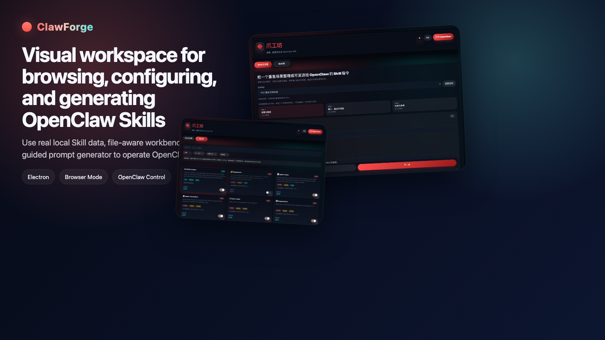
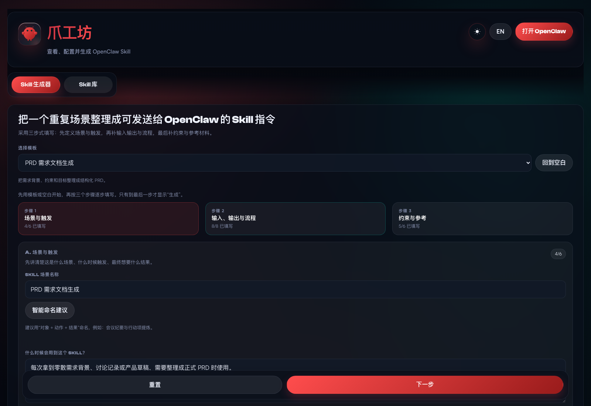
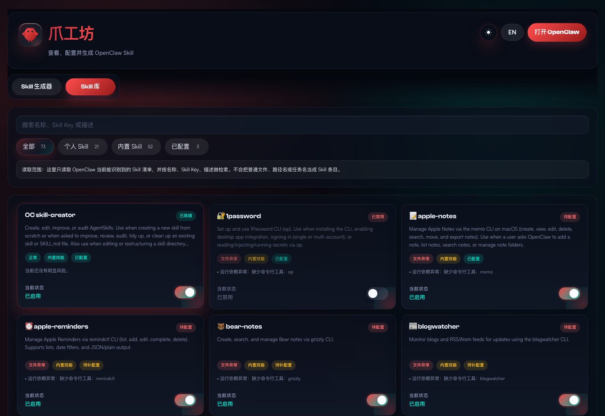
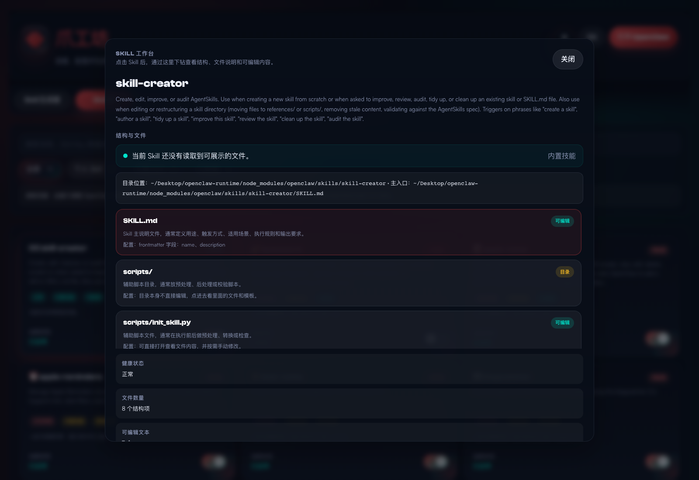
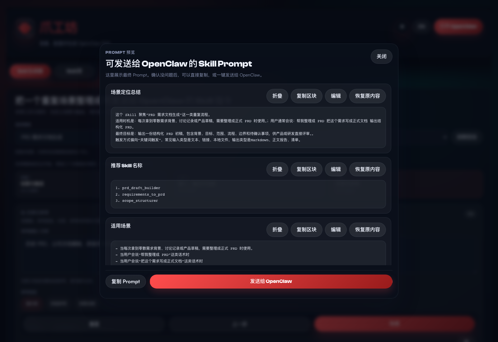

# ClawForge

[](https://github.com/kelin3296-jpg/openclaw-skill-visual-config-client/releases)
[](https://github.com/kelin3296-jpg/openclaw-skill-visual-config-client/actions/workflows/ci.yml)
[](LICENSE)

ClawForge is an open-source desktop and browser workspace for browsing, configuring, and generating OpenClaw Skills from real local data.

中文说明：ClawForge 是一个面向本地 OpenClaw 环境的开源可视化工作台，支持浏览真实 Skill、查看结构文件、手动修改配置，以及生成并发送 Skill Prompt。



## Why ClawForge

OpenClaw Skills usually live across local config, skill folders, `SKILL.md`, and supporting files. ClawForge brings these parts together into one workspace so you can:

- inspect real Skills instead of mock examples
- understand what each file means inside a Skill
- edit config and local content safely
- generate new Skill prompts from structured scenarios
- send prompts to OpenClaw Control in one step

## Highlights

- Real local data: reads actual OpenClaw Skills and config from your machine
- Skill Library: search, filter, enable, disable, and drill into Skills quickly
- Skill Workbench: inspect file structure, config hints, and editable files
- Skill Generator: build reusable scenario-based Skill prompts with a guided flow
- OpenClaw send flow: open the real Google Chrome browser and auto-send compatible prompt payloads
- Dual runtime: Electron desktop client plus browser mode for UI iteration
- Cross-platform support: works with macOS and Windows path conventions

## Main Areas

### Skill Generator

- three-step guided form
- reference material management
- preview modal for final prompt
- one-click send to OpenClaw

### Skill Library

- lightweight search and filtering
- dense multi-card layout
- enable / disable Skill switches
- drill-down workbench modal

### Skill Workbench

- file structure overview
- file purpose and config hints
- local editable file content with save-back

## Screenshots

### Skill Generator



### Skill Library



### Skill Workbench



### Prompt Preview



## Quick Start

### Desktop client

```bash
npm install
npm start
```

### Browser mode

```bash
npm install
npm run dev:web
```

Then open:

```text
http://127.0.0.1:4318
```

## Requirements

- Node.js 20+
- A local OpenClaw environment
- Google Chrome installed if you want the automated browser send flow

## Project Structure

```text
public/
  index.html                    UI layout and styles
  app.js                        client state and interactions
  skill-generator-shared.js     shared generator logic
src/
  main.js                       Electron entry
  preload.js                    desktop bridge
  server.js                     local API server
  lib/
    openclaw-service.js         local OpenClaw data + config logic
    openclaw-control.js         OpenClaw Control browser automation
tests/
  *.test.js                     service, UI, generator, and control coverage
```

## Scripts

```bash
npm start      # Electron desktop client
npm run dev    # Electron desktop client
npm run dev:web
npm test
npm run smoke
npm run dist
```

## Platform Notes

### Windows

The project already handles these default Windows paths:

- OpenClaw config: `%USERPROFILE%\\.openclaw\\openclaw.json`
- OpenClaw CLI: `%APPDATA%\\npm\\openclaw.cmd`
- Bundled Skills: `%APPDATA%\\npm\\node_modules\\openclaw\\skills`

If your setup differs, you can override with:

```bash
OPENCLAW_BIN=C:\path\to\openclaw.cmd
OPENCLAW_CONFIG_PATH=C:\path\to\openclaw.json
OPENCLAW_STATE_DIR=C:\path\to\.openclaw
```

### macOS

- supports local OpenClaw config discovery
- supports Chrome-based OpenClaw Control automation
- supports Electron desktop packaging

## Validation

Run before publishing or opening a PR:

```bash
npm test
npm run smoke
```

## Roadmap

- richer release assets for macOS and Windows
- better attachment coverage for more material types
- improved Skill health diagnostics and repair flows
- optional screenshots and demo walkthroughs in the repo homepage

## Documentation

- [Deployment guide](docs/DEPLOY.md)
- [Contributing guide](CONTRIBUTING.md)
- [Security policy](SECURITY.md)

## License

MIT. See [LICENSE](LICENSE).
